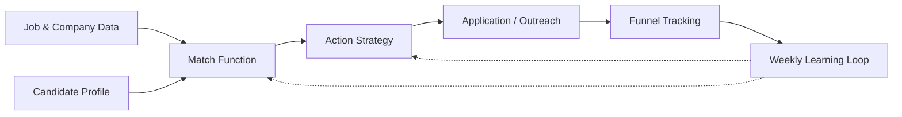

# AI Job Search OS

> **An AI-powered operating system for improving job-search conversion rates — from job discovery to fit matching, application strategy, funnel tracking, and weekly optimization.**

[中文版本 / Chinese README →](./README_CN.md)

---

Most job-search tools help candidates find more jobs or generate more resumes.

**AI Job Search OS focuses on a different problem:**

> **How do you systematically increase the probability of getting a high-quality offer?**

It supports the full job-search loop:

1. Collect job and company data
2. Parse the candidate profile and resume
3. Match candidate × job × company fit
4. Prioritize the best opportunities
5. Generate application and outreach strategy
6. Track funnel progression
7. Learn from outcomes and improve the next round

The core idea is simple:

> **Job search is not a volume game. It is a conversion optimization problem.**

---

## Who Is This For

This system can be used by:

- **Fresh graduates** trying to identify realistic entry paths
- **Career switchers** trying to reposition themselves
- **Mid-career professionals** seeking a better-fit next role
- **Senior candidates** who want to avoid wasting time on low-fit opportunities
- **Anyone** who wants to treat job search as a measurable funnel instead of random applications

It is especially useful if you are applying across many roles, companies, or regions and need a structured way to decide:

- Which jobs are worth applying to
- Which companies are worth direct outreach
- Which applications are wasting time
- Where your funnel is breaking
- What to change next week

## What This Is

AI Job Search OS is a **local, agent-driven workflow** for managing and optimizing a job search.

It helps candidates:

- Build a **structured candidate profile** from resume, experience, skills, preferences, and constraints
- Collect and parse **job opportunities** from job boards, company pages, or manually imported JDs
- Classify each opportunity into **A/B/C/D tiers** using a rule-based Match Function
- Decide the best **action** for each opportunity: skip, save, apply, apply + DM, referral, or founder outreach
- Track every opportunity through a **funnel**: sourced → applied → read → replied → interview → offer
- Review **weekly conversion metrics** and update strategy based on real outcomes

The system is designed to be used with [Claude Code](https://claude.ai/code) or similar agent runtimes, but the architecture can be adapted to any AI assistant.

## What This Is Not

- ❌ Not an auto-apply spam bot
- ❌ Not a generic job board scraper
- ❌ Not a resume keyword stuffing tool
- ❌ Not a black-box recommendation engine
- ❌ Not a system that promises offers

It does **not** replace human judgment.

It helps candidates make better job-search decisions by **structuring the process, reducing noise, and learning from funnel outcomes**.

## System Architecture



| Layer | Question It Answers |
|---|---|
| **Job & Company Data** | What opportunities exist? |
| **Candidate Profile** | Who is the candidate, and what do they want? |
| **Match Function** | Which jobs are worth pursuing? |
| **Action Strategy** | How should this opportunity be attacked? |
| **Funnel Tracking** | What happened after action? |
| **Learning Loop** | What should change next week? |

Full architecture details: [`docs/SYSTEM.md`](./docs/SYSTEM.md).

## What Makes This Different

Most AI job-search tools optimize for **speed**:

- more jobs scraped
- more resumes generated
- more applications submitted

AI Job Search OS optimizes for **conversion quality**:

- fewer bad-fit applications
- clearer opportunity prioritization
- better outreach decisions
- measurable funnel diagnosis
- weekly strategy updates based on outcomes

The goal is **not**:

> "Apply to 500 jobs."

The goal is:

> **"Understand which 30 jobs are actually worth fighting for — and improve the probability that they turn into interviews and offers."**

### Five design principles you won't find elsewhere

1. **Match ≠ Reward separation** — pre-decision strategic judgment is *not* updated by post-decision noisy feedback until you have ≥ 100 outcome data points
2. **Rubric > Formula at v0** — no pseudo-precision scores like `+10 / -5`; use ordinal Tiers and funnel stages instead
3. **User-in-the-loop tier adjustment** — if Match has ≥ 3 unknown signals, ask the user; never silently downgrade
4. **Observable funnel ≠ true funnel** — default trust user; offline-handled inbound is not penalized
5. **Memory has auto-maintenance** — 5-type taxonomy + Sunday auto-archival; no over-engineered metadata

## Using with an AI Agent

Most users will run this through an AI agent (Claude Code, Hermes, Cursor, etc.) rather than reading the docs themselves.

If that's you, just clone and tell your agent:

> **"Read AGENTS.md and onboard me."**

The agent will walk you through ~50 minutes of setup — diagnosing your situation, building your candidate profile, calibrating the Match Function — before any automation runs. **Don't skip to `templates/`. The system needs your inputs first.**

See [AGENTS.md](./AGENTS.md) for the full agent-onboarding flow.

## Quick Start — installable skill (Hermes)

If you use [Hermes Agent](https://github.com/erichare/hermes-agent), this repo ships an installable skill:

```bash
git clone https://github.com/Xiao-yun-Hu/ai-job-search-os.git
cd ai-job-search-os
bash scripts/install.sh          # creates ~/.ai-job-search/, symlinks skill, optional cron setup, registers chrome-devtools MCP

# start Chrome with CDP (once per machine session)
open -a "Google Chrome" --args --remote-debugging-port=9222
curl -s http://127.0.0.1:9222/json/version | python3 -c \
  "import json,sys; print(json.load(sys.stdin).get('Browser'))"
```

Then in Hermes:
```
> /skills run ai-job-search "morning outreach"
```

The skill enforces a **memory bootstrap** at the start of every session — every L3 persona file gets loaded first, so a new conversation never starts blank. See [`docs/MEMORY_LAYERS.md`](./docs/MEMORY_LAYERS.md) for the 4-layer architecture (inspired by [Tencent TencentDB-Agent-Memory](https://github.com/Tencent/TencentDB-Agent-Memory)).

Browser execution architecture and runtime safety policy:
- [`docs/BROWSER_BACKEND.md`](./docs/BROWSER_BACKEND.md)
- [`docs/RUNTIME_GOVERNOR.md`](./docs/RUNTIME_GOVERNOR.md)

## Quick Start — manual (no agent)

```bash
# 1. Clone
git clone https://github.com/Xiao-yun-Hu/ai-job-search-os.git
cd ai-job-search-os

# 2. Read the system docs
open docs/SYSTEM.md            # Full architecture, decision logic, memory design
open docs/MEMORY_LAYERS.md     # 4-layer memory architecture (v3)
open docs/BROWSER_BACKEND.md   # Browser backend (chrome-devtools-mcp + Hermes prefix)
open docs/RUNTIME_GOVERNOR.md  # Action Governor policy model

# 3. Set up your project structure
bash scripts/install.sh --no-cron   # creates ~/.ai-job-search/ with L1/L2/L3 layout

# 4. Fill in your candidate profile
$EDITOR ~/.ai-job-search/L3_persona/candidate_profile.md

# 5. Customize search config (keywords, daily_cap)
$EDITOR ~/.ai-job-search/operational/search_config.json

# 6. (Optional) Configure LLM for the nightly distillation pipeline:
export AI_JOB_SEARCH_LLM_URL=https://api.openai.com/v1
export AI_JOB_SEARCH_LLM_KEY=sk-...
export AI_JOB_SEARCH_LLM_MODEL=gpt-4o-mini

# 7. Run the distillation pipeline (dry-run, see what it would do):
python3 scripts/distill.py --dry-run

# 8. Start Chrome with remote debugging before browser-driven runs:
open -a "Google Chrome" --args --remote-debugging-port=9222

# 9. Run a manual evaluation
# Open Claude Code / Hermes, ask: "Read SKILL.md and run Match Function on this JD: [paste JD]"
```

## Example Outputs

See [`examples/`](./examples/) for anonymized samples:

- [`sample-morning-report.md`](./examples/sample-morning-report.md) — Daily morning task output: 95 raw jobs → hard gates → cardinal score → Match Function → 5 sent (Tier A:2 / B:3) + 2 saved + 1 pending + 2 skipped
- [`sample-retro.md`](./examples/sample-retro.md) — Daily retro with funnel-stage tracking and Match-Reward-separated optimizations
- [`sample-weekly.md`](./examples/sample-weekly.md) — Weekly summary with bottleneck identification and next-week experiment design

## Folder Structure

```
ai-job-search-os/
├── AGENTS.md                  # Onboarding flow for AI agents (read this first if you're an agent)
├── docs/
│   ├── SYSTEM.md              # Full architecture + decision logic + memory design
│   ├── MEMORY_LAYERS.md       # v3: 4-layer memory architecture (L0/L1/L2/L3)
│   ├── BROWSER_BACKEND.md     # v3.1: Hermes + chrome-devtools-mcp backend
│   └── RUNTIME_GOVERNOR.md    # v3.1: policy layer (intent vs execution controls)
├── skills/
│   └── ai-job-search/
│       └── SKILL.md           # Installable Hermes skill (with Step 0 bootstrap)
├── runtime/
│   └── policy.yaml            # v3.1: per-platform Action Governor policy
├── scripts/
│   ├── install.sh             # One-shot installer (data dir + skill symlink + cron)
│   └── distill.py             # Nightly distillation: L0 sessions → L1 atoms → L2 retro → L3
├── templates/
│   ├── config.yaml.template
│   ├── L1_atoms_schema.md     # v3: atom JSONL schema
│   ├── memory/                # L3 persona templates (6 files, v3 design)
│   └── scheduled-tasks/       # Cron-driven task definitions (5 files)
├── examples/                  # Anonymized sample outputs (3 files)
├── LICENSE                    # MIT
├── README.md / README_CN.md   # Bilingual entry (this file)
└── STATUS.md                  # Build log
```

## Customization Guide

What you fill in for your own use:

| What you fill in | Where |
|---|---|
| Your narrative pillars (3-5 core stories) | `memory/project_candidate_profile.md` |
| Your hard constraints (geo, salary, role types) | `memory/decision_*.md` files |
| Your target company list | `memory/project_target_companies.md` |
| Your search keywords | `config.yaml` `search.keywords` |
| Your outreach message | `config.yaml` `outreach.message` |
| Your job board scraping logic | `templates/scheduled-tasks/job-board-morning-outreach.template.md` (Phase 1 / 3) |

## Roadmap

**v3.1 (current)** — installable Hermes skill + memory bootstrap + Action Governor + `chrome-devtools-mcp` browser backend.

**v3.2 planned**:
- Job board adapters: LinkedIn Easy Apply, SEEK, Indeed, Greenhouse-public
- Resume parsing pipeline (PDF/DOCX → structured candidate profile)
- Better example coverage (1-2 full anonymized end-to-end runs)

**v4.0 ideas**:
- Conditional probability estimation when sample ≥ 100 (transition from heuristic to learned)
- Funnel visualization dashboard
- Multi-region search rules (overseas LinkedIn DM templates by region)
- Public marketplace of community-contributed Match rubrics by role family

Open an issue to suggest priorities or contribute adapters.

## Origin Story

This repo started as one candidate's working operating system — running daily for an active job search, evolving via real funnel evidence. The original use case was an Applied AI / Solutions Architect candidate doing parallel domestic + overseas search across BOSS Zhipin, LinkedIn, and direct outreach.

But the architecture is **not specific to AI roles**. The 5-type memory taxonomy, Match Function rubric, ordinal funnel stages, and Match-Reward separation principle apply to any job search where:

- Total target list is finite (50-500 companies)
- Candidate has a defined narrative (3-5 core proof-of-work stories)
- Outcomes need to be measured to improve next-week strategy

It's released as MIT for anyone who wants the framework. Examples in this repo are anonymized.

## Contributing

Open an issue or PR. Particularly welcome:

- Adapters for other job boards (currently the morning-outreach template assumes generic browser automation)
- Examples from successful runs (anonymized)
- Memory-design improvements
- Empirical evidence on funnel rates (with sample sizes)
- Translations beyond EN / CN

## License

MIT — see [LICENSE](./LICENSE).

## Acknowledgments

Architecture references:

- [CoALA: Cognitive Architectures for Language Agents](https://arxiv.org/abs/2309.02427) — 5-type memory taxonomy
- [Generative Agents (Park et al, 2023)](https://arxiv.org/abs/2304.03442) — reflection-based memory compression (light version)
- [Letta benchmarks: "Filesystem is all you need"](https://www.letta.com/blog/benchmarking-ai-agent-memory) — confirming file-based works at this scale
