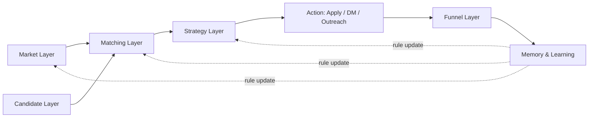

# AI Job Search OS

> A measurable conversion-funnel system for AI / Applied AI / Solutions job search. Built for **offer conversion rate**, not application volume.

[中文版本 / Chinese README →](./README_CN.md)

---

## The Core Thesis

Job search is not random application volume. It is a **measurable conversion funnel**:

```
Market → Candidate → Match → Strategy → Action → Funnel → Memory
```

Every layer can be diagnosed. Every transition can be measured. Most "improvement" advice is **reward signals applied to the wrong layer** — e.g., "0 replies → demote that role type" (when n=2). This system separates **Match** (strategic judgment, pre-decision) from **Reward** (market feedback, post-decision), so noisy outcomes don't destabilize strategic choices.

**Goal**: Maximize the probability of a **vibe-matched, role-fit, offer** within a defined time horizon. Not maximize application count.

## What This Is

- A **system architecture** for designing your own job search infrastructure (templates included)
- A **decision framework** (Match Function v0) that classifies opportunities into Tier A/B/C/D using rubric, not pseudo-precision scores
- A **memory schema** (5 types: identity / decision / feedback / project / meta) with auto-archival mechanics
- A set of **scheduled task templates** (morning outreach, evening retro, daily learnings, weekly summary, LinkedIn outreach) for [Claude Code](https://claude.ai/code) or similar agent runtimes
- An **anti-pattern playbook** — the things this system explicitly avoids (false-precision rewards, silent tier downgrades, observable-funnel-as-truth)

## What This Is Not

- Not a job-board scraper or auto-apply spam tool
- Not a recommendation engine (no ML at v0 — sample sizes are too small)
- Not a one-size-fits-all template (you must fill in your own narrative pillars, target list, hard constraints)
- Not a SaaS product — runs locally with your own AI agent

## Who Is This For

- **AI / Applied AI / Solutions** candidates with 5+ years experience and a defined narrative
- People who want **systematic, measurable** job search instead of "spray and pray"
- Anyone using [Claude Code](https://claude.ai/code) or similar agent runtimes who wants persistent memory + scheduled automation
- People doing **3-month focused job searches** with a strong existing role (not desperate, can afford "right next step" framing)

## Quick Start

```bash
# 1. Clone
git clone https://github.com/Xiao-yun-Hu/ai-job-search-os.git
cd ai-job-search-os

# 2. Read the system docs
open docs/SYSTEM.md       # Architecture, decision logic, memory design

# 3. Set up your project structure
mkdir -p ~/job-search/{logs,research,memory,system}
cp templates/config.yaml.template ~/job-search/config.yaml
cp templates/memory/*.template.md ~/job-search/memory/

# 4. Fill in your candidate profile
$EDITOR ~/job-search/memory/project_candidate_profile.template.md
# Rename: mv project_candidate_profile.template.md project_candidate_profile.md

# 5. Customize config.yaml (keywords, hard gates, outreach message)
$EDITOR ~/job-search/config.yaml

# 6. (Optional) Install scheduled tasks for Claude Code
cp templates/scheduled-tasks/*.template.md ~/.claude/scheduled-tasks/

# 7. Run a manual evaluation
# Open Claude Code, ask: "Read SYSTEM.md and run Match Function on this JD: [paste JD]"
```

## Architecture (TL;DR)



| Layer | Purpose | Output |
|---|---|---|
| **Market** | Map opportunity zones, target lists | Tiered company list, vibe research |
| **Candidate** | Structured profile (5 narrative pillars + constraints) | `project_candidate_profile.md` |
| **Matching** | Score (JD × company) → Tier A/B/C/D | Match Function v0 (rule-based, ordinal) |
| **Strategy** | Decide how to attack each Tier | Apply / DM / outreach / save / skip |
| **Funnel** | Track ordinal stage progression | sent < read < reply < deep_chat < interview < offer |
| **Memory** | Daily/weekly aggregation, revise upper layers | 5-type taxonomy with auto-archival |

## Folder Structure

```
ai-job-search-os/
├── docs/
│   └── SYSTEM.md              # Full architecture + decision logic
├── templates/
│   ├── config.yaml.template
│   ├── memory/                # 5-type memory templates
│   │   ├── MEMORY.template.md
│   │   ├── user_*.template.md
│   │   ├── decision_*.template.md
│   │   ├── feedback_*.template.md
│   │   ├── project_*.template.md
│   │   └── memory_management_rules.template.md
│   └── scheduled-tasks/       # Cron-driven task definitions
│       ├── job-board-morning-outreach.template.md
│       ├── evening-retro.template.md
│       ├── daily-learnings-review.template.md
│       ├── weekly-summary.template.md
│       └── linkedin-outreach.template.md
├── examples/
│   └── anonymized-run.md      # Sample retro / morning report (no PII)
├── LICENSE                    # MIT
└── README.md
```

## Core Design Principles

### 1. Match ≠ Reward

The system's most important rule. **Match** (pre-decision strategic judgment) is **not** updated by **Reward** (post-decision market feedback) until you have ≥100 outcome data points. Otherwise, a 2-application 0-reply sample becomes an excuse to demote a role type that's actually fine — and you lose the strategic compass.

### 2. Rubric > Formula at v0

No pseudo-precision scores like 78.3 / 5 or `+10 / -5` reward weights. Use:
- **Hard gates** (geo / role / salary / culture) — boolean
- **Tier A/B/C/D** classification — ordinal
- **Funnel stages** (sent < read < reply < deep_chat < interview < offer) — ordinal
- **Weekly empirical questions** — answered with (count, ratio), not "reward improved by X"

Numeric weights enter only when sample ≥ 100 / replies ≥ 20 / interviews ≥ 5.

### 3. User-in-the-Loop Tier Adjustment

When Match has ≥3 unknown signals, do NOT silently downgrade. Either:
- Ask the user (interactive session)
- Queue as `pending_user_input` (autonomous task)
- Wait up to 48h before silent downgrade with reason

### 4. Observable Funnel ≠ True Funnel

Most automation only sees what's logged in the system. **Default trust** the user — apparent "unanswered" inbound is assumed handled offline (phone, DM, email, in-person) unless user logs a miss. This avoids penalizing the user for the system's blind spots.

### 5. Memory Has Auto-Maintenance

5-type taxonomy + minimal frontmatter (3 fields) + Sunday auto-archival + monthly rule audit. No `importance / last_referenced / expires_at / links` over-engineering at v0 — those are research-paper concepts that don't pay off below ~50 memory files.

## Customization Guide

See [`docs/SYSTEM.md`](./docs/SYSTEM.md) for full architecture. Key adaptations per user:

| What you need to fill in | Where |
|---|---|
| Your narrative pillars (3-5 core stories) | `memory/project_candidate_profile.md` |
| Your hard constraints (geo, salary, role types) | `memory/decision_*.md` files |
| Your target company list | `memory/project_target_companies.md` (index pointing to your full target list) |
| Your search keywords | `config.yaml` `search.keywords` |
| Your outreach message | `config.yaml` `outreach.message` |
| Your job board scraping logic | `templates/scheduled-tasks/job-board-morning-outreach.template.md` (Phase 1 / 3) |

## Examples

See `examples/` for an anonymized sample run:
- A daily morning report with Match-tier classification
- A daily retro with funnel-stage tracking
- A weekly summary with bottleneck identification

## Why This Exists

Most "AI for job search" tools are aggregators (auto-apply spam) or chatbot resume-tweakers. They don't address the actual bottleneck for senior candidates: **strategic targeting + measurable iteration**.

This repo started as one candidate's working operating system — running daily for an active job search, evolving via real funnel evidence. It's released as MIT for anyone who wants the framework.

## Contributing

Open an issue or PR. Particularly welcome:
- Adapters for other job boards (currently the morning-outreach template assumes generic browser automation)
- Examples from successful runs (anonymized)
- Memory-design improvements
- Empirical evidence on funnel rates (with sample sizes)

## License

MIT — see [LICENSE](./LICENSE).

## Acknowledgments

Architecture references:
- [CoALA: Cognitive Architectures for Language Agents](https://arxiv.org/abs/2309.02427) — 5-type memory taxonomy
- [Generative Agents (Park et al, 2023)](https://arxiv.org/abs/2304.03442) — reflection-based memory compression (light version)
- [Letta benchmarks: "Filesystem is all you need"](https://www.letta.com/blog/benchmarking-ai-agent-memory) — confirming file-based works at this scale
