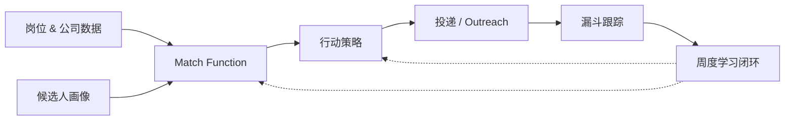

# AI Job Search OS

> **一个用 AI 提高求职 offer 转化率的操作系统：从岗位搜集、简历解析、匹配筛选、申请策略，到转化漏斗追踪和周度优化。**

[English README →](./README.md)

---

市面上大多数求职工具帮候选人**找更多岗位**或**生成更多简历**。

**AI Job Search OS 关注一个不同的问题：**

> **如何系统性地提高拿到高质量 offer 的概率？**

它支持完整的求职闭环：

1. 收集岗位和公司数据
2. 解析候选人画像和简历
3. 匹配 候选人 × 岗位 × 公司 的 fit
4. 优先级排序：哪些机会值得打
5. 生成投递和 outreach 策略
6. 跟踪漏斗推进状态
7. 从结果学习，迭代下一轮

核心理念很简单：

> **求职不是体力活。它是一个转化率优化问题。**

---

## 适合谁

这个系统适合：

- **应届毕业生** —— 找到现实可行的入口路径
- **转行者** —— 重新定位自己
- **中职业生涯专业人士** —— 寻找更匹配的下一份工作
- **资深候选人** —— 不想浪费时间在低 fit 机会上
- **任何人** —— 想把求职当作可度量漏斗而不是随机投递的人

特别适合**横跨多个岗位、公司或地区**投递时，需要结构化决策：

- 哪些岗位值得投
- 哪些公司值得直接 outreach
- 哪些投递在浪费时间
- 漏斗哪一段在断
- 下周该改什么

## 这个系统是什么

AI Job Search OS 是一个**本地的、agent 驱动的求职管理工作流**。

它帮候选人：

- 用简历、经历、技能、偏好、约束**构建结构化 candidate profile**
- 从 job board / 公司页 / 手动导入的 JD **收集和解析岗位机会**
- 用 rule-based Match Function 把每个机会分到 **A/B/C/D 档**
- 给每个机会决定**最佳行动**：跳过 / 保留 / 投递 / 投递+DM / 内推 / 创始人 outreach
- 通过**漏斗**跟踪每个机会：发掘 → 投递 → 已读 → 回复 → 面试 → offer
- 复盘**每周转化率**，根据真实结果更新策略

系统设计用于 [Claude Code](https://claude.ai/code) 或类似 agent runtime，但架构可以适配任何 AI 助手。

## 这个系统不是什么

- ❌ 不是自动投递垃圾工具
- ❌ 不是通用 job board 爬虫
- ❌ 不是简历关键词堆砌工具
- ❌ 不是黑盒推荐引擎
- ❌ 不是承诺 offer 的系统

它**不**替代人的判断。

它通过**结构化流程、降噪、从漏斗结果学习**，帮候选人做更好的求职决策。

## 系统架构



| 层 | 回答的问题 |
|---|---|
| **岗位 & 公司数据** | 有哪些机会? |
| **候选人画像** | 候选人是谁，想要什么? |
| **Match Function** | 哪些岗位值得追? |
| **行动策略** | 这个机会怎么打? |
| **漏斗跟踪** | 行动后发生了什么? |
| **学习闭环** | 下周该改什么? |

完整架构详见 [`docs/SYSTEM.md`](./docs/SYSTEM.md)。

## 它和其他工具有什么不同

大多数 AI 求职工具优化**速度**：

- 爬更多岗位
- 生成更多简历
- 提交更多投递

AI Job Search OS 优化**转化质量**：

- 更少的低 fit 投递
- 更清晰的机会优先级
- 更好的 outreach 决策
- 可度量的漏斗诊断
- 基于真实结果的周度策略更新

目标**不是**：

> "投 500 份简历。"

目标是：

> **"搞清楚哪 30 个岗位真正值得打，提高它们转化为面试和 offer 的概率。"**

### 5 个你在别处看不到的设计原则

1. **Match ≠ Reward 分离** —— 决策前的战略判断**不**因决策后的 noisy 反馈而修改，直到累积 ≥ 100 outcome 数据点
2. **v0 阶段用 Rubric 而非 Formula** —— 不要 `+10 / -5` 这种伪精确分数；用 ordinal Tier + 漏斗 stage
3. **User-in-the-Loop tier 调整** —— Match 出现 ≥ 3 个 unknown signal，先问用户；永不静默降级
4. **Observable funnel ≠ true funnel** —— 默认信任用户；线下处理的 inbound 不算 cost
5. **记忆自动维护** —— 5 类 taxonomy + 周日自动归档；不要 over-engineer metadata

## 用 AI agent 跑（推荐）

大多数用户会通过 AI agent（Claude Code / Cursor 等）使用这个系统，而不是自己读 docs。

如果是这样，clone 后告诉你的 agent：

> **"读 AGENTS.md，给我做 onboarding"**

Agent 会带你走完 ~50 分钟的 setup —— 诊断你的情况、建 candidate profile、calibrate Match Function —— **再开始任何自动化**。**不要跳过 templates/ 直接跑**，系统需要你先提供输入。

完整 agent onboarding 流程见 [AGENTS.md](./AGENTS.md)。

## Quick Start（手动，不用 agent）

```bash
# 1. Clone
git clone https://github.com/Xiao-yun-Hu/ai-job-search-os.git
cd ai-job-search-os

# 2. 读系统文档
open docs/SYSTEM.md       # 完整架构、决策逻辑、记忆设计

# 3. 建你自己的项目目录
mkdir -p ~/job-search/{logs,research,memory,system}
cp templates/config.yaml.template ~/job-search/config.yaml
cp templates/memory/*.template.md ~/job-search/memory/

# 4. 填写你的 candidate profile
$EDITOR ~/job-search/memory/project_candidate_profile.template.md
# 重命名: mv project_candidate_profile.template.md project_candidate_profile.md

# 5. 定制 config.yaml（关键词 / 硬约束 / 投递消息）
$EDITOR ~/job-search/config.yaml

# 6.（可选）给 Claude Code 安装 scheduled tasks
cp templates/scheduled-tasks/*.template.md ~/.claude/scheduled-tasks/

# 7. 跑一次手动评估
# 打开 Claude Code，问："读 SYSTEM.md，给这个 JD 跑一遍 Match Function: [贴 JD]"
```

## 样例输出

在 [`examples/`](./examples/) 里有 anonymized 样例：

- [`sample-morning-report.md`](./examples/sample-morning-report.md) —— 每日早间任务输出：95 个原始岗位 → hard gates → cardinal scoring → Match Function → 投出 5 条（Tier A:2 / B:3）+ 2 条保留 + 1 条 pending + 2 条跳过
- [`sample-retro.md`](./examples/sample-retro.md) —— 每日 retro，含漏斗 stage 跟踪和 Match-Reward 分离的优化
- [`sample-weekly.md`](./examples/sample-weekly.md) —— 周度总结，含 bottleneck identification 和下周实验设计

## 目录结构

```
ai-job-search-os/
├── AGENTS.md                  # AI agent 的 onboarding 指引（agent 第一个该读的文件）
├── docs/
│   └── SYSTEM.md              # 完整架构 + 决策逻辑 + 记忆设计
├── templates/
│   ├── config.yaml.template
│   ├── memory/                # 5 类 memory taxonomy 模板（12 个文件）
│   └── scheduled-tasks/       # Cron 驱动的任务定义（5 个文件）
├── examples/                  # Anonymized 样例输出（3 个文件）
├── LICENSE                    # MIT
├── README.md / README_CN.md   # 双语入口（本文）
└── STATUS.md                  # Build log
```

## 定制指南

你需要填的核心位置：

| 要填什么 | 在哪填 |
|---|---|
| 5 大 narrative pillar（你的核心故事） | `memory/project_candidate_profile.md` |
| 硬约束（地理 / 薪资 / role 类型） | `memory/decision_*.md` 各文件 |
| 目标公司清单 | `memory/project_target_companies.md` |
| 搜索关键词 | `config.yaml` `search.keywords` |
| 投递消息 | `config.yaml` `outreach.message` |
| Job board 抓取逻辑 | `templates/scheduled-tasks/job-board-morning-outreach.template.md`（Phase 1 / 3） |

## Roadmap

**v1.0（当前）** —— 系统架构 + 模板 + Claude Code 集成。通用浏览器自动化模式的 job-board outreach。

**v1.1 计划中**：
- Job board adapters：LinkedIn Easy Apply, SEEK, Indeed, Greenhouse-public
- 简历解析 pipeline（PDF/DOCX → 结构化 candidate profile）
- 更完整的样例（1-2 份完整 anonymized 端到端运行）

**v2.0 想法**：
- 累积 ≥ 100 数据点后引入条件概率估计（从 heuristic 过渡到 learned）
- 漏斗可视化 dashboard
- 多地区 outreach 规则（按地区分的 LinkedIn DM 模板）
- 社区贡献的 Match rubric marketplace（按 role family 分）

开 issue 提优先级或贡献 adapter。

## 起源

这个 repo 源于一个候选人正在用的工作系统 —— 每天跑、根据真实漏斗证据演化。最初的用例是 Applied AI / Solutions Architect 候选人在 BOSS 直聘、LinkedIn、直接 outreach 这些渠道并行做国内+海外求职。

但**架构本身不限于 AI 岗位**。5 类 memory taxonomy、Match Function rubric、ordinal 漏斗 stage、Match-Reward 分离原则适用于任何符合下面条件的求职：

- 总目标清单是有限的（50-500 家公司）
- 候选人有明确的 narrative（3-5 个核心 proof-of-work 故事）
- 结果需要被度量以改善下周策略

MIT license 开源给任何想用这套框架的人。本 repo 中所有样例都是 anonymized 的。

## 贡献

开 issue 或 PR。特别欢迎：

- 其他 job board 的 adapter（当前 morning-outreach 模板假设通用浏览器自动化）
- anonymized 真实运行样例
- 记忆设计改进
- 漏斗转化率的实证数据（带 sample size）
- EN / CN 之外的翻译

## License

MIT —— 见 [LICENSE](./LICENSE)。

## Acknowledgments

架构参考：

- [CoALA: Cognitive Architectures for Language Agents](https://arxiv.org/abs/2309.02427) —— 5 类 memory taxonomy
- [Generative Agents (Park et al, 2023)](https://arxiv.org/abs/2304.03442) —— reflection-based 记忆压缩（light 版）
- [Letta benchmarks: "Filesystem is all you need"](https://www.letta.com/blog/benchmarking-ai-agent-memory) —— 验证 file-based 在这个 scale 下足够
