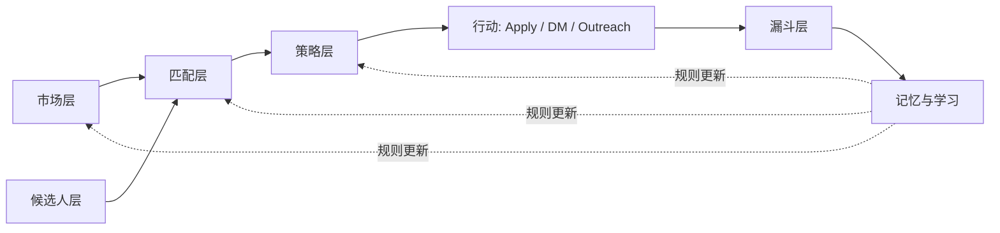

# AI 求职操作系统 (AI Job Search OS)

> 面向 AI / Applied AI / Solutions 岗位的可度量转化漏斗求职系统。为 **offer 转化率**优化，不是为投递量。

[English README →](./README.md)

---

## 核心论点

求职不是随机投递的体力活。它是一个**可度量的转化漏斗**：

```
市场 → 候选人 → 匹配 → 策略 → 行动 → 漏斗 → 记忆
```

每一层都可以诊断。每一次转化都可以测量。大多数"改进建议"是**把 reward 信号用错了层** —— 比如 "0 回复 → 降级这个 role type"（当 n=2 时）。这个系统严格分离 **Match**（决策前的战略判断）和 **Reward**（决策后的市场反馈），让 noisy outcome 不破坏战略选择。

**目标**：在限定时间内最大化获得 **vibe 匹配 + 岗位形态 fit** 的 offer 概率。不是最大化投递数量。

## 这个系统是什么

- 一份**系统架构**，给你设计自己的求职基础设施（含模板）
- 一个**决策框架**（Match Function v0），把机会用 rubric 分到 Tier A/B/C/D，不用 78.3 分这种伪精确
- 一个**记忆架构**（5 类：identity / decision / feedback / project / meta），含自动归档机制
- 一组**定时任务模板**（晨间投递、晚间复盘、每日学习、周度总结、LinkedIn outreach），适用于 [Claude Code](https://claude.ai/code) 或类似 agent runtime
- 一份**反模式 playbook** —— 这个系统明确避免的事（伪精确 reward、静默降 tier、把 observable funnel 当 true funnel）

## 这个系统不是什么

- 不是 job-board 爬虫或自动投递垃圾工具
- 不是推荐引擎（v0 不上 ML —— sample size 还远不够）
- 不是 one-size-fits-all 模板（你必须填自己的 narrative pillars / 目标公司 / 硬约束）
- 不是 SaaS 产品 —— 用你自己的 AI agent 在本地跑

## 适合谁

- **AI / Applied AI / Solutions** 候选人，5+ 年经验，有明确的 narrative
- 想做**系统化、可度量**求职而不是"广撒网赌概率"的人
- 用 [Claude Code](https://claude.ai/code) 或类似 agent runtime，想要**持久记忆 + 定时自动化**的人
- 做**3 个月聚焦型求职**且当前已有稳定职位的人（不是 desperate，承担得起"对的下一步"的取舍）

## Quick Start

```bash
# 1. Clone
git clone https://github.com/Xiao-yun-Hu/ai-job-search-os.git
cd ai-job-search-os

# 2. 读系统文档
open docs/SYSTEM.md       # 架构、决策逻辑、记忆设计

# 3. 建你自己的项目目录
mkdir -p ~/job-search/{logs,research,memory,system}
cp templates/config.yaml.template ~/job-search/config.yaml
cp templates/memory/*.template.md ~/job-search/memory/

# 4. 填写你的 candidate profile
$EDITOR ~/job-search/memory/project_candidate_profile.template.md
# 重命名: mv project_candidate_profile.template.md project_candidate_profile.md

# 5. 定制 config.yaml（关键词 / 硬约束 / 投递消息）
$EDITOR ~/job-search/config.yaml

# 6.（可选）给 Claude Code 安装 scheduled tasks
cp templates/scheduled-tasks/*.template.md ~/.claude/scheduled-tasks/

# 7. 跑一次手动评估
# 打开 Claude Code，问："读 SYSTEM.md，给这个 JD 跑一遍 Match Function: [贴 JD]"
```

## 架构 (TL;DR)



| 层 | 用途 | 输出 |
|---|---|---|
| **市场层** | 识别机会区域、目标清单 | Tiered 公司清单 + vibe 调研 |
| **候选人层** | 结构化 profile（5 大 narrative pillar + 约束） | `project_candidate_profile.md` |
| **匹配层** | 给 (JD × 公司) 打 fit → Tier A/B/C/D | Match Function v0 (rule-based, ordinal) |
| **策略层** | 决定每个 Tier 怎么打 | Apply / DM / outreach / 保留 / 跳过 |
| **漏斗层** | 跟踪 ordinal stage 推进 | sent < read < reply < deep_chat < interview < offer |
| **记忆层** | 日 / 周 aggregation，反向修正前面层 | 5 类 taxonomy + 自动归档 |

## 目录结构

```
ai-job-search-os/
├── docs/
│   └── SYSTEM.md              # 完整架构 + 决策逻辑
├── templates/
│   ├── config.yaml.template
│   ├── memory/                # 5 类 memory 模板
│   │   ├── MEMORY.template.md
│   │   ├── user_*.template.md
│   │   ├── decision_*.template.md
│   │   ├── feedback_*.template.md
│   │   ├── project_*.template.md
│   │   └── memory_management_rules.template.md
│   └── scheduled-tasks/       # Cron 驱动的任务定义
│       ├── job-board-morning-outreach.template.md
│       ├── evening-retro.template.md
│       ├── daily-learnings-review.template.md
│       ├── weekly-summary.template.md
│       └── linkedin-outreach.template.md
├── examples/
│   └── anonymized-run.md      # 样例 retro / morning 报告（无 PII）
├── LICENSE                    # MIT
└── README.md / README_CN.md
```

## 核心设计原则

### 1. Match ≠ Reward

整个系统**最重要的规则**。**Match**（决策前的战略判断）**不**因为 **Reward**（决策后的市场反馈）而修改，**直到累积 ≥100 outcome 数据点**。否则一个 n=2 的样本会让你降级一个其实没问题的 role type —— 战略指南针就废了。

### 2. v0 阶段：Rubric > Formula

不要 78.3/5 或 `+10 / -5` 这种伪精确 reward weights。用：
- **Hard gates**（地理 / 角色 / 薪资 / 文化）—— boolean
- **Tier A/B/C/D** 分类 —— ordinal
- **漏斗 stage**（sent < read < reply < deep_chat < interview < offer）—— ordinal
- **每周经验性提问** —— 用 (count, ratio) 回答，不是"reward 提升 X 分"

数字 weight 只有在 sample ≥100 / replies ≥20 / interviews ≥5 之后才能进入。

### 3. User-in-the-Loop Tier 调整

当 Match 出现 ≥3 个 unknown signal 时，**不要静默降级**。两种处理：
- 直接问用户（interactive session）
- 排队成 `pending_user_input`（autonomous task）
- 用户 48 小时不回应才静默降一档（写 reason）

### 4. Observable Funnel ≠ True Funnel

大多数自动化只看见自己 log 的东西。**默认信任用户** —— 表面上"未回复"的 inbound 默认假设已线下处理（电话、DM、邮件、面对面），除非用户主动说"我 miss 了"。这避免系统因自己看不到而 penalize 用户。

### 5. 记忆有自动维护

5 类 taxonomy + 极简 frontmatter（3 字段）+ 周日自动归档 + 月度规则审计。v0 阶段不要 `importance / last_referenced / expires_at / links` 这种 over-engineer —— 它们是研究论文里的概念，在 ~50 个 memory 文件以下不产生价值。

## 定制指南

完整架构见 [`docs/SYSTEM.md`](./docs/SYSTEM.md)。核心填写位置：

| 要填什么 | 在哪填 |
|---|---|
| 5 大 narrative pillar（你的核心故事） | `memory/project_candidate_profile.md` |
| 硬约束（地理 / 薪资 / role 类型） | `memory/decision_*.md` 各文件 |
| 目标公司清单 | `memory/project_target_companies.md`（索引指向完整清单文件） |
| 搜索关键词 | `config.yaml` `search.keywords` |
| 投递消息 | `config.yaml` `outreach.message` |
| Job board 抓取逻辑 | `templates/scheduled-tasks/job-board-morning-outreach.template.md`（Phase 1 / 3） |

## 例子

`examples/` 里有 anonymized 样例：
- 一份带 Match tier 分类的早间报告
- 一份带漏斗 stage 跟踪的当日 retro
- 一份周度总结含 bottleneck identification

## 为什么有这个系统

大多数"AI for 求职"工具是聚合器（垃圾自动投递）或 chatbot 改简历的。它们不解决 senior 候选人真正的瓶颈：**战略 targeting + 可度量的迭代**。

这个 repo 来自一个候选人正在用的工作系统 —— 每天跑、根据真实漏斗证据演化。MIT license 开源给任何想用这套框架的人。

## 贡献

开 issue 或 PR。特别欢迎：
- 其他 job board 的 adapter（当前 morning-outreach 模板假设通用浏览器自动化）
- 真实运行的 anonymized 样例
- 记忆设计改进
- 漏斗转化率的实证数据（带 sample size）

## License

MIT —— 见 [LICENSE](./LICENSE)。

## 参考

架构参考：
- [CoALA: Cognitive Architectures for Language Agents](https://arxiv.org/abs/2309.02427) —— 5 类 memory taxonomy
- [Generative Agents (Park et al, 2023)](https://arxiv.org/abs/2304.03442) —— reflection-based 记忆压缩（light 版）
- [Letta benchmarks: "Filesystem is all you need"](https://www.letta.com/blog/benchmarking-ai-agent-memory) —— 验证 file-based 在这个 scale 下足够
