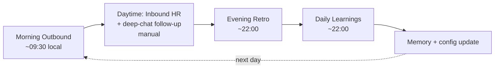
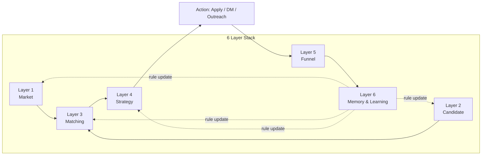
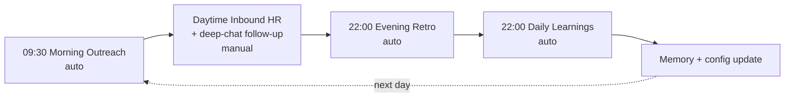
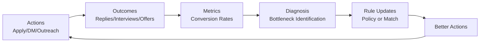
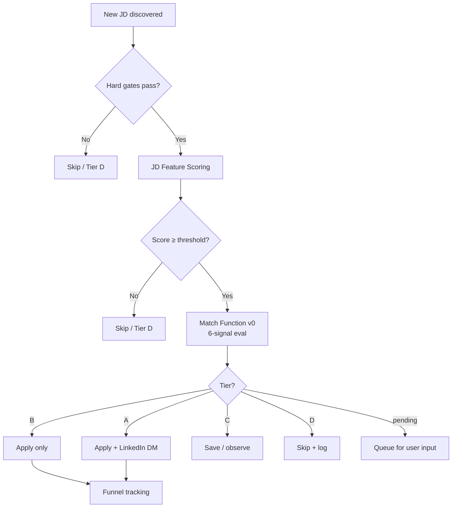

# AI Job Search Operating System: Workflow, Architecture, and Self-Improvement Plan

> **Version**: v1.0
> **License**: MIT
> **Repo**: `ai-job-search-os`
> **Core thesis**: Job search is not random application volume. It is a measurable conversion funnel where every layer can be diagnosed and improved. Goal: **maximize offer conversion rate**, not application count.

---

## Table of Contents

1. [Current Mission](#1-current-mission)
2. [System Architecture](#2-system-architecture)
3. [Current Workflow](#3-current-workflow)
4. [Decision Logic](#4-decision-logic)
5. [Candidate Positioning](#5-candidate-positioning)
6. [Funnel Metrics](#6-funnel-metrics)
7. [Memory Design](#7-memory-design)
8. [Self-Improvement Loop](#8-self-improvement-loop)
9. [Diagrams](#9-diagrams)
10. [Common Gaps](#10-common-gaps)
11. [7-Day Operating Plan](#11-7-day-operating-plan)

---

## 1. Current Mission

### 1.1 Target Outcome

The system optimizes for **a high-quality offer match within a defined time horizon** (typical: 3 months / 90 days). What "match" means is **user-defined** — every candidate has different priorities. Common dimensions:

- **Vibe / culture fit** (team, founder, working style)
- **Role-form fit** (does the work match what you actually want to do)
- **Compensation** (cash / equity / total comp)
- **Geographic fit** (cities, remote-friendliness)
- **Speed / timing** (need offer by X date vs. opportunistic)
- **Career trajectory** (growth / brand / responsibility scope)

The user states their priority among these in their candidate profile. The system applies that priority — it does not bake in a default like "vibe > money" or "growth > comp". **Different candidates legitimately rank these differently**, and the system respects that.

> **Loss function (qualitative)**: `min(time_wasted_on_misfits + opportunity_cost_of_missed_good_fits)`. Not `max(application_count)`.

### 1.2 Candidate Profile (template — fill in `templates/memory/project_candidate_profile.template.md`)

```yaml
identity: name, contact, current_location
experience: total_years, timeline (companies × roles)
education: masters, bachelors
technical_capabilities: [list]
business_capabilities: [list]
proof_of_work: flagship_project + impact_metrics
preferences: preferred_role_types, rejected_role_types, geography, compensation_expectations, decision_priority (user-stated; e.g., vibe / comp / speed / trajectory / etc.)
narrative_pillars: 3-5 core stories with specific numbers
```

### 1.3 Preferred Role Types (typical for AI systems candidates)

✅ Applied AI Lead / AI Systems Designer / AI Solutions Architect
✅ Forward-Deployed AI / AI Product Engineer
✅ Agent Workflow Designer / Decision Systems Lead

❌ Pure AI Engineer (infra-heavy) / Generic Data Scientist / Generic AI PM / Pure model-training scientist

### 1.4 What System Should Avoid (anti-patterns)

- ❌ Volume-driven applications without targeting
- ❌ Skipping vibe research before applying (front-load 30 min beats backloading 5 interview rounds)
- ❌ Marketing-heavy "AI Workforce / AI Employee / VoiceGPT" companies (proxy for hype-led culture)
- ❌ Accepting roles repeating the past 5+ years of profile (no leverage)
- ❌ Overfitting reward weights from < 100 data points (false precision)

---

## 2. System Architecture

A 6-layer stack. Data flows from market layer → through candidate × matching × strategy → into action × funnel × memory & learning. Memory layer feeds back to revise the upper layers.

### Layer 1: Market Layer

**Purpose**: Map the AI job market structure. Identify high-demand / low-supply opportunity zones.

**Inputs**:
- VC portfolio mining (top-tier seed/early funds)
- AI-focused media (industry reports, trend articles)
- Hiring signals (job boards, applicant tracking systems, mailing lists)
- Founder public material (Twitter/X, blog, podcasts, conference talks)
- Candidate's own past responses (which target types replied)

**Outputs**: Tiered target company list, vibe research per company, hidden-opportunity list (companies that haven't formalized the role you fit).

**Failure modes**:
- Stale data (lists not refreshed monthly)
- Source bias (e.g., only checking VCs misses bootstrapped companies)
- Trending ≠ fit (don't follow hype)

### Layer 2: Candidate Layer

**Purpose**: Express the candidate as structured profile, not vague text.

Stored as `project_candidate_profile_*.md` (see template).

**Update cadence**:
- Identity / education: rarely
- Preferences: monthly review
- Capabilities: when resume changes

### Layer 3: Matching Layer

**Purpose**: Score (job × company) fit, output stable Tier (A/B/C/D). **The system's ranking brain**.

See [Section 4.3 Match Function v0](#43-match-function-v0) for full spec.

**Failure modes**:
- Subjective scoring (mitigate with rubric + signals)
- No ground truth (mitigate with weekly funnel calibration)

### Layer 4: Strategy Layer

**Purpose**: Decide *how* to attack each Tiered opportunity.

| Strategy | When |
|---|---|
| Skip | Tier D |
| Save for later | Tier C with strategic value |
| Apply only | Tier B (standard) |
| Apply + LinkedIn DM | Tier A or B with high company quality |
| Founder / hiring manager outreach | Tier A or "hidden opportunity" (no public role) |
| Referral search | Tier A with 1st/2nd LinkedIn connection |

### Layer 5: Funnel Layer

**Purpose**: Track every application from start to finish. Output diagnosable metrics. **Without this, "improvement" is guessing.**

Ordinal stage progression (see [Section 6](#6-funnel-metrics)):
```
sent < read < reply < deep_chat < interview < final < offer
```

### Layer 6: Memory & Learning Layer

**Purpose**: Daily/weekly aggregation; revises upper layers based on evidence.

5-type memory (see [Section 7](#7-memory-design)):
- `identity` (who the candidate is)
- `decision` (hard rules used by tasks)
- `feedback` (soft preferences / learned heuristics)
- `project` (current context / state)
- `reference` (pointers to external systems)

---

## 3. Current Workflow

### 3.1 Daily Workflow (weekdays)



### 3.2 Per-step

**Step 1: Morning Outbound** (cron `30 9 * * 1-5` local time)
- Search platforms by configured keywords
- Apply hard gates (geo / role / salary / culture)
- Run JD feature scoring (cardinal, threshold = 7)
- Run Match Function v0 (output Tier A/B/C/D)
- Send applications for Tier A/B
- Save Tier C, queue `pending_user_input`, skip D

**Step 2: Daytime Inbound** (manual, throughout day)
- Handle inbound HR proactively
- Don't let > 24h pass on warm leads (or assume offline-handled, see "Observable funnel" principle)

**Step 3: Evening Retro** (cron `0 22 * * *` local time)
- Aggregate today's funnel data
- Compute conversion rates by dimension (with sample-size caveats)
- Pattern observation (do NOT update Match rules — see [Section 4.8](#48-match-reward-separation))
- Adjust **search-side keywords** if needed (search efficiency only)
- Adjust **policy** (channel / message / timing) if signals strong
- Write retro_YYYYMMDD.md, push 1-line phone notification

**Step 4: Daily Learnings Review** (cron `0 22 * * *`)
- Scan today's conversations
- Extract feedback / project / decision / identity memories
- Write to memory/, update MEMORY.md index

### 3.3 Weekly Workflow (recommended)

```
0 21 * * 0  weekly-summary  → reads last 7 retros → writes weekly_YYYYWW.md → moves >4-week retros to archive/
```

Asks 4 questions:
1. Which (tier × role × channel) combinations advanced furthest?
2. Did Tier A + DM outperform Tier B + apply-only?
3. Did role title X outperform role title Y?
4. Did channel X outperform channel Y?

**Use evidence (count, ratio)**, not reward scores.

---

## 4. Decision Logic

> **Core architecture**: Hard Gate → Match → Policy → Outcome → Reward. **Match (pre-decision) and Reward (post-decision) are strictly separated** — see [4.8](#48-match-reward-separation).

### 4.1 Hard Gates

Filter before scoring. Any fail → Tier D / Skip.

**Geographic Gate**: User-configured allow-list of cities / regions. Reject otherwise.

**Role Type Gate**: User-configured blacklist (typical: pure model training, low-level engineer, generic DS, generic PM, vision, robotics, content safety, outsourcing).

**Compensation Gate**:
- `salary_max < floor` → reject
- Salary undisclosed but high-quality company → don't gate, negotiate later
- Salary undisclosed AND company unknown → downgrade one tier

**Culture Gate**: Strong evidence of 996 / rigid / hype-only / "always-on" culture → reject.

### 4.2 JD Feature Detection (Cardinal scoring — input-side, OK)

**This is deterministic feature detection at input, not outcome reward.** Cardinal weights are OK here — they're relative weighting of "does the JD mention X?" against the candidate's preferences.

Example (`config.yaml` `jd_scoring.dimensions`):
```yaml
multi_agent_mention: +2
llm_rag_mention: +1.5
eval_framework: +1.5
causal_reasoning: +1.5
agent_orchestration: +2
knowledge_graph: +1
experience_match: +1
overseas_founder: +1
flexible_work: +0.5
```

Red flags (-100, immediate skip):
- `outsourcing_mention`
- `gender_requirement`
- (other domain-specific blockers)

**Threshold (e.g., 7) = passes basic feature scoring, eligible for full Match evaluation.**

> ⚠️ These weights are **heuristic config, not a model**. Based on candidate preferences, not learned. **Do not adjust based on reply rate before 100+ applications** (see [4.8](#48-match-reward-separation)).

### 4.3 Match Function v0

**Purpose**: Decide whether (JD + Company) is worth pursuing. **Output is a stable Tier (A/B/C/D), not a precise score.**

> **Principle**: Cold-start, rule-based system. Does **not** pretend to be a statistical model until ≥ 100 outcome data points. **All numeric weights are temporary heuristics, not truth.**

#### Inputs

```yaml
match_input:
  candidate_profile:
    source: project_candidate_profile.md (SSOT)
    fields: preferred_role_types, rejected_role_types, strongest_capabilities,
            hard_constraints, compensation_expectations, geography_preferences,
            culture_preferences, narrative_pillars
  jd:
    title, location, salary_range, seniority, responsibilities, requirements,
    keywords, team_context, remote_or_hybrid, application_channel
  company_context:
    company_type, stage, team_size, founder_background, product_category,
    ai_native_level, vibe_signals, risk_signals
```

#### Step 1: Role Type Classification

Classify the JD into 1 primary + 0-N secondary role types.

**Preferred** (high potential):
- AI Systems Designer / Applied AI Lead / AI Solutions Architect
- Forward-Deployed AI / AI Product Engineer
- Agent Workflow Designer / Decision Systems Lead
- AI Transformation Lead with system-design scope

**Risky** (downscore but don't auto-reject):
- AI Engineer (infra-heavy) / Agent Engineer (implementation-heavy)
- Generic AI PM / Generic DS / Strategy Consultant without build scope
- Pre-sales without architectural authority

#### Step 2: 6-Signal Classification (ordinal, not cardinal)

Each signal: `strong / medium / weak / negative / unknown`. **Do not compute weighted score.**

| # | Signal | Question | Strong | Negative |
|---|---|---|---|---|
| 1 | **Role Alignment** | Does this role actually let me design AI systems / workflows / decision logic? | "AI system design", "agent workflow", "solution architecture", "cross-functional AI implementation" | Generic DS / dashboard / basic LLM API / prompt-only / pure PM coordination |
| 2 | **AI Systems Relevance** | Close to multi-agent / decision / eval experience? | multi-agent / orchestration / RAG with workflow / tool use / memory / eval / reasoning | Model training / vision / robotics / pure infra / pure backend |
| 3 | **Business / Workflow Relevance** | Connects AI to real business? | enterprise workflow / decision support / process automation / customer-facing AI | Academic research / isolated model / internal tooling |
| 4 | **Seniority / Scope Fit** | Right altitude? | lead / architect / senior IC with design authority / cross-functional ownership | Junior / narrow executor / CTO too high / pure manager |
| 5 | **Company Context Fit** | Does company likely value this profile? | AI-native / agent-workflow / enterprise-AI focus / early-mid stage / research-DNA founder | Marketing-led wrapper / pure model lab without applied / outsourcing / traditional Co. with AI veneer |
| 6 | **Vibe / Culture Fit** | Would I be comfortable here? | Thoughtful founder / anti-hype / sustainable pace / international team / hybrid | 996 / rigid attendance / founder worship / "AI Employee" hype |

> **v0 Note**: Signal 6 (Vibe) often can't be assessed from JD alone — requires separate founder/blog/podcast research (≥30 min). **Before promoting to Tier A, vibe must be researched** (otherwise default to `unknown` and trigger [Section 4.4](#44-unknown-handling-protocol)).

#### Step 3: Tier Rules

**Tier A — Strong Match / Must Attack**:
- All hard gates pass
- Role Alignment = `strong`
- AI Systems Relevance ≥ `medium`
- Business / Workflow Relevance = `strong`
- Seniority Fit ≥ `medium`
- Company Context Fit ≥ `medium`
- No major vibe red flag (vibe researched ≥ `medium`)
- **Action**: apply + targeted outreach + resume tailoring

**Tier B — Good Match / Apply Selectively** (axis must hold):
- All hard gates pass
- **Role Alignment ≥ `medium` AND AI Systems Relevance ≥ `medium`** (axis lock)
- ≥ 2 other signals = `strong`
- **Action**: apply (+ optional DM if company quality is high)

**Tier C — Weak / Strategic / Save**:
- All hard gates pass
- Partial relevance
- ≥ 1 key signal = `weak`
- **Action**: don't prioritize / save as backup / apply only if low-effort

**Tier D — Skip**:
- Any hard gate fails OR
- Role clearly off-target OR
- Company vibe / culture unacceptable
- **Action**: skip + log reason (for market learning)

#### Step 4: Fast Paths (skip full 6-signal eval)

For obvious A/D, skip the full pipeline (~60% time savings):

- **Fast D**: Hard gate fail → straight to D
- **Fast A**: Title is exactly "AI Solutions Architect" + company on top-tier list + vibe already researched ≥ medium → straight to A
- **Fast Skip**: Company on `company_blacklist.json` → straight to D

#### Step 5: Output Schema

Each evaluated JD produces:

```json
{
  "company": "",
  "job_title": "",
  "location": "",
  "primary_role_type": "",
  "secondary_role_types": [],
  "hard_gate_pass": true,
  "failed_gate": null,
  "signals": {
    "role_alignment": "strong | medium | weak | negative | unknown",
    "ai_systems_relevance": "...",
    "business_workflow_relevance": "...",
    "seniority_scope_fit": "...",
    "company_context_fit": "...",
    "vibe_culture_fit": "..."
  },
  "tier": "A | B | C | D | pending_user_input",
  "recommended_action": "",
  "reasoning": "",
  "main_strengths": [],
  "main_risks": [],
  "missing_information": [],
  "outreach_angle": "",
  "resume_tailoring_notes": "",
  "market_learning_value": "high | medium | low"
}
```

### 4.4 Unknown Handling Protocol (User-in-the-Loop)

> **Principle**: When multiple signals are `unknown`, **do not silently downgrade** the tier. Downgrading is a user-authorized action, not a system unilateral move.

**Trigger**:
- ≥ 3 signals `unknown` → user-input protocol triggers (not automatic downgrade)
- 2 signals `unknown` AND neither is Role Alignment / AI Systems Relevance → keep tier (axis is visible)
- 1 signal `unknown` → no impact

**Protocol** (per session type):

| Context | Action |
|---|---|
| Interactive (user present) | Ask in chat: "Have you heard of company X? Know its vibe?" — finalize tier after response |
| Autonomous task (morning batch / retro) | Don't interrupt user — flag JD as `tier: pending_user_input`, queue for evening retro batch review |
| User responds | Provide info → recompute; "downgrade" → apply with reason; "trust default" → keep tier |
| User unresponsive > 48h | Silently downgrade one tier with reason "user did not provide signal within 48h" |

### 4.5 Vibe Rubric (Signal 6 detail)

5 dimensions + 1 composite gut score.

| Dimension | 1 = poor | 5 = excellent |
|---|---|---|
| Founder character | Egotistical / marketing-led / academic posturing | Pragmatic / anti-hype / scientist-builder |
| Tech depth honesty | Buzzword-heavy / replaces substance with marketing | Real benchmarks / acknowledges limits / open about failures |
| Team reflection capability | PR-driven / static culture | Public post-mortems / changes course / introspective |
| Customer focus | Investor-language / valuation-story-driven | User-language / solving concrete problems |
| Velocity-stability balance | 996 / rigid in-office / "move fast and break things" only | Thoughtful / sustainable / hybrid-friendly |
| **Composite gut**: Would the candidate enjoy and survive here? (1-5) |

**Warning signals (-)**:
- ❗ "AI Workforce" / "AI Employee" / "Universal AI Employee" / "VoiceGPT" / anthropomorphizing buzzwords
- ❗ "Top 1% talent only" / "$1M revenue/employee" / "always-on" → high 996 risk
- ❗ Banker-CEO / pure-sales-first founder → engineering soul thin

**Positive signals (+)**:
- ✅ ex-OpenAI / ex-Meta FAIR / ex-Stripe / PhD + research-DNA founder
- ✅ Public discussion of evaluation / observability / eval harness
- ✅ Founder posts substantive technical content (not pure announcements) on Twitter/X
- ✅ "Specialized agents > general purpose" / "R2D2 not Skynet" / anti-hype framing

### 4.6 Policy / Action Mapping (Tier → Action)

```
Tier A:
  apply + LinkedIn DM (founder/CTO/hiring-manager) + resume tailoring
  if no public role: founder outreach only

Tier B:
  apply (+ DM if company quality is high)
  resume tailoring only if Role Alignment = strong

Tier C:
  save / observe
  apply only if low-effort + market_learning_value high

Tier D:
  skip + log reason

Tier pending_user_input:
  queue + wait for user input (interactive ask or evening retro batch review)
```

> **Critical**: Policy receives Reward feedback (channel / message / timing optimization). **Match does not.** See [4.8](#48-match-reward-separation).

### 4.7 Reward Design v0

> **Principle**: Rubric > Formula. **All numeric weights in this document are temporary heuristics, not truth.**

This system does **not** use fixed numeric reward weights. Sample size at v0 is too small to fit any statistical model.

Instead:
1. **Hard Constraints** (4.1) filter clear-bad actions
2. **Tier Classification** (4.3) Match output ranks opportunities
3. **Funnel-stage Progression** (ordinal): `sent < read < reply < deep_chat < interview < final < offer`
4. **Weekly Empirical Calibration**: ask questions, don't update weights

#### Per-week reward evaluation (Sunday retro)

Ask 4 questions, answer with (count, ratio) form — **never "reward improved by X points"**:

1. Which (tier × role_type × channel) combinations advanced to higher stage?
2. Did Tier A + apply+DM outperform Tier B + apply_only?
3. Did role-title X outperform role-title Y in reply rate?
4. Did channel X outperform channel Y in funnel progression?

#### When can numeric weights enter?

Only when accumulated:
- ≥ 100 applications
- ≥ 20 replies
- ≥ 5 interviews

Then estimate `P(reply | role_type, channel, tier)` as conditional probabilities. **Before that, any weight is heuristic config, not a model.**

#### Observable Funnel Principle

- **Observable funnel ≠ true funnel.**
- User-handled-offline activity (phone, WeChat / DM, email, in-person) is invisible to the system.
- **Default trust**: silent "unanswered" inbound is **not penalized** — assume already handled offline.
- Only when user explicitly logs "I missed this" should it count as cost.

### 4.8 Match-Reward Separation

> **Match ≠ Reward.** This is the foundational rule of the entire decision logic.

| Phase | Question | Function | Input | Output |
|---|---|---|---|---|
| Pre-decision | Is this JD worth pursuing? | **Match** (4.3) | candidate + JD + company | Tier A/B/C/D |
| Decision | How to attack this Tier? | **Policy** (4.6) | Tier + current capacity | apply / DM / outreach / skip |
| Post-decision | Did that action work? | **Reward** (4.7) | action + outcome | signal (good/bad/neutral) |

**Critical constraints**:

1. **Reward only modifies Policy, never Match directly.**
   - Example: "Role X got 0 replies" doesn't mean "Role X is the wrong target." It might be resume / channel / timing. So Reward should adjust channel or message, **not demote the keyword in Match**.

2. **Match = strategic judgment. Reward = market feedback.**
   - Match: cold-start rules from candidate preferences + industry knowledge + user judgment
   - Reward: tests whether Match was correct

3. **Match revision conditions**: Cumulative ≥ 100 applications + clear repeated pattern + candidate confirmation → only then revise Match rules.

4. **Anti-pattern**: A retro that demotes a search keyword based on n=2 outcome (no replies) is mixing Reward into Match. Don't do this. Use search efficiency (no candidates returned) for keyword priority, not outcome reply rate.

---

## 5. Candidate Positioning

### 5.1 One-line Positioning (template)

```
"I [verb] [target] by [method], [outcome metric]."
```

Example structure:
> "I design [WHAT — production-grade decision systems / agent workflows / AI solutions] by [HOW — combining signals + knowledge graphs + causal reasoning], elevating [WHAT — LLMs from content-generators to decision infrastructure]."

Both English and target-region language versions should exist (for outreach / interviews).

### 5.2 Role Positioning

**Preferred** — fill in 5-7 specific titles matching candidate's narrative
**Acceptable with caveats** — strategic fits requiring case-by-case JD review
**Rejected** — hard list of role types to skip

### 5.3 Narrative Pillars (3-5 core stories)

Each pillar = **claim + specific number + (TODO: client case as STAR story)**.

Example structure:

| # | Claim | Number | Use case |
|---|---|---|---|
| 1 | [Process compression] | [Multiplier, e.g., 20×] | Open with ROI / business impact framing |
| 2 | [Scale leverage] | [Multiplier, e.g., 10×] | Systems thinking / scalability |
| 3 | [Quality gating] | [Threshold, e.g., ≥95% accuracy] | Evaluation harness capability |
| 4 | [Framework reuse] | [Speedup, e.g., 12×] | Engineering leverage |
| 5 | [Technical depth] | [Method, e.g., 4-layer reasoning architecture] | Domain expertise |

Pillars should be repeated consistently across resume / outreach / interview.

### 5.4 Decision Priority Trade-off Matrix (user-customized)

> ⚠️ **No universal answer.** Different candidates rank these dimensions differently. The matrix below shows three example user profiles. **Your candidate profile states your own priority**, and the matrix adapts.

#### Example A: Vibe-prioritizing user (e.g., already has stable role, looking for "right next step")

| Vibe | Comp acceptable | Decision |
|---|---|---|
| 4.5+ | Yes | Strong push |
| 4.5+ | Slightly below ceiling | Accept, negotiate to mid-range |
| 4.0 | Yes | Push |
| 4.0 | Slightly low | Negotiate equity / learning curve |
| 3.0-3.5 | Yes | Lower priority than 4.5+ |
| < 3.0 | Any | Skip — vibe is the binding constraint |

#### Example B: Comp-prioritizing user (e.g., short timeline, financial milestone, dependents)

| Comp | Vibe acceptable | Decision |
|---|---|---|
| Above ceiling | Yes (any vibe ≥ 3) | Strong push |
| At ceiling | Yes (vibe ≥ 3.5) | Push |
| At ceiling | Vibe < 3 | Negotiate vibe risk vs comp gain |
| Slightly below ceiling | Vibe ≥ 4 | Push if comp can be pulled up |
| Below floor | Any | Skip — comp is the binding constraint |

#### Example C: Speed-prioritizing user (e.g., visa deadline, role gap)

Trade-off lens: minimize time-to-offer with floor-acceptable other dimensions.
- Maximize "Apply → Interview" velocity
- Accept any vibe ≥ 3 + comp ≥ floor + geo OK if it's fast
- Don't optimize for top-tier; optimize for *any* offer in time window

> The user's stated priority (in `project_candidate_profile.md` "Decision Priority" section) selects which matrix applies.

---

## 6. Funnel Metrics

### 6.1 Volume Metrics

Track cumulative since start:
- Jobs collected
- Applications sent
- Inbound HR (proactive contacts from companies)
- Manual deep-chats (incl. inbound-driven)
- Interviews confirmed
- Offers

### 6.2 Conversion Rates (compute as ratios with sample-size annotations)

| Stage transition | Calculation |
|---|---|
| Apply → Delivered | Delivered / Applied |
| Delivered → Read | Read / Delivered |
| Read → Reply | Reply / Read |
| Reply → Deep-chat | Deep-chat / Reply |
| Deep-chat → Interview | Interview / Deep-chat |
| Interview → Offer | Offer / Interview |

Also track end-to-end:
- Apply → Deep-chat
- Apply → Interview
- Apply → Offer

> ⚠️ **Sample-size annotation required.** Below 10: treat as noisy, do not act on rate. Below 100: do not modify Match rules.

### 6.3 Quality Metrics (slice by dimension)

- Avg fit-score of applied jobs (are we picking high or low?)
- Reply rate by `role_type`
- Reply rate by `channel`
- Reply rate by `company_tier`
- Rejection reason categories (salary / experience / gender / role-mismatch / other)
- Time to first response (median + 75th)
- Time to interview (apply → first interview)

### 6.4 Inbound Rate (algorithmic-recommendation signal)

Active job-board presence yields algorithmic recommendation → inbound HR contacts. **Stopping daily activity loses this** — daily participation has compound value beyond direct outreach.

### 6.5 Weekly Funnel Diagnosis Template

Sunday retro template:

```markdown
# Week WW (date_start - date_end) Funnel Diagnosis

## Volume (vs prev week)
- Apps: X (±%) | Inbound: X | Deep-chats: X | Interviews: X

## Conversion
- Apply → Reply: X% (target ≥15%)
- Reply → Interview: X% (target ≥30%)

## Bottleneck identification (pick one)
- [ ] Targeting (too many misfits enter funnel)
- [ ] Resume signal (delivered but not read / read but not replied)
- [ ] Channel (only one channel in use)
- [ ] Role mismatch (deep-chats reveal JD/resume mismatch)
- [ ] Market timing (holiday / fiscal year)
- [ ] Candidate narrative (interview-stage friction)

## Hypothesis next week
## Experiments to run
```

---

## 7. Memory Design

> **v3 design (2026-05-11)**: Consolidated from a fragmented 14-file structure to 6 purposeful files. Each file has a single, clear responsibility. See `templates/memory/` for templates.

### 7.1 File Map

| File | Type | Responsibility | Update cadence |
|---|---|---|---|
| `decision_task_rules.md` | decision | Hard rules automated tasks must follow unconditionally | On rule change |
| `feedback_job_search_strategy.md` | feedback | Soft strategy — target criteria, culture filter, signal handling, outreach principles | Weekly |
| `project_candidate_profile.md` | project | Full candidate snapshot: communication style, resume, comp, role targets, narrative pillars | On resume/comp change |
| `project_company_targets.md` | project | Target company execution status (Track A/B) | On each outreach action |
| `project_job_search_current_state.md` | project | Operational snapshot — overwritten nightly by evening-retro | Nightly |
| `memory_management_rules.md` | meta | System self-rules (this section's analog) | On architecture change |

> **Why no `identity` type?** Global user identity (language, communication preferences) belongs at the user level, not inside a specific project's memory. Each project's memory scope is the project itself. If you use Claude Code across multiple projects, store global user facts at `~/.claude/` level instead.

### 7.2 Frontmatter Schema (3 fields only)

```yaml
---
name: short_name
description: one_line_purpose
type: decision | feedback | project
---
```

**Do NOT add:** `originSessionId`, `importance`, `last_referenced`, `expires_at`, `links`.
Exception: if a rule has a clear expiry date, put it in the body as "**Valid until YYYY-MM-DD**".

### 7.3 SSOT (Single Source of Truth) Principle

Before creating new memory, grep for the fact:

```bash
grep -r "keyword" memory/
```

| Information type | Only location |
|---|---|
| Candidate facts (resume, comp, role targets) | `project_candidate_profile.md` |
| Job-search strategy preferences | `feedback_job_search_strategy.md` |
| Automated task hard rules | `decision_task_rules.md` |
| Full target company list | Your authoritative list file (external) |
| Company outreach status | `project_company_targets.md` |
| Daily application records | `applications.jsonl` |
| Daily retro logs | `logs/retro_YYYYMMDD.md` |

On SSOT violation: merge to the SSOT location, update other files to reference.

### 7.4 What Goes in Memory vs What Doesn't

**✅ Memory** (cross-session persistent facts / rules / strategy):
- Hard rules tasks must follow at runtime
- Strategy preferences learned from interviews / market feedback
- Candidate profile snapshot and company outreach status
- Nightly operational snapshot

**❌ Not memory** (operational data / ephemeral observations):
- Daily application records → `applications.jsonl`
- Daily retro logs → `logs/retro_YYYYMMDD.md`
- One-off company observations (interview feel, specific HR message) → `logs/retro_YYYYMMDD.md`
  → Graduate to `feedback_job_search_strategy.md` only when the observation becomes a reusable pattern
- Weekly / quarterly summaries → `logs/weekly_*.md`

### 7.5 Archival Rules

| Trigger | Action |
|---|---|
| `logs/retro_*.md` > 4 weeks old | Move to `logs/archive/` |
| `project_candidate_profile.md` has a newer version | Move old to `memory/archive/` |
| A rule in `decision_task_rules.md` hasn't triggered in 30+ days | Flag for monthly audit — do not auto-delete |
| `feedback_job_search_strategy.md` contradicted by recent evidence | Flag for user decision |

### 7.6 Storage Map

| Type | Location |
|---|---|
| Cross-session memory | `memory/` (auto-loaded via `MEMORY.md` index) |
| Daily logs | `logs/retro_YYYYMMDD.md`, `logs/morning_YYYYMMDD.md` |
| Weekly summaries | `logs/weekly_*.md` |
| Research output | `research/` |
| Application records | `applications.jsonl` |
| Config | `config.yaml` |
| System docs | `docs/` (this file) |

---

## 8. Self-Improvement Loop

### 8.1 Daily Loop (already in retro task)

Each retro must contain:
```markdown
### Observation (today's data)
### Hypothesis (what to test)
### Evidence (data vs hypothesis)
### Decision (maintain / modify config / new experiment)
### Updated Rule / Next Action
```

Constraint: modifying config requires sample ≥ 5; modifying Match rules requires sample ≥ 100 (see [4.8](#48-match-reward-separation)).

### 8.2 Weekly Loop (Sunday cron)

Run [Funnel Diagnosis Template](#65-weekly-funnel-diagnosis-template).

Then design 1-2 experiments based on identified bottleneck:

| Bottleneck | Playbook |
|---|---|
| Targeting | Audit keyword performance, drop low-yield, add new exploration |
| Resume signal | A/B test self-introduction sections, add quantified results |
| Channel | Add LinkedIn DM (if not used), try referrals |
| Role mismatch | Adjust expected city / JD title / narrative |
| Market timing | Wait, monitor funding announcements |
| Candidate narrative | Post-mortem each interview, refine STAR stories |

### 8.3 Match-Reward Separation in Practice

Daily retro should produce **two distinct outputs**:
- **Search-side adjustments** (allowed to modify Match): `keyword X returned 0 candidates 3 days running → demote`
- **Policy-side adjustments** (allowed to modify Action / channel / message): `09:30 sends had 80% read rate vs 10:30 had 50% → keep early`

Anything mixing outcome reply rate with keyword priority **is forbidden** until sample ≥ 100.

---

## 9. Diagrams

### 9.1 Overall Architecture



### 9.2 Daily Workflow



### 9.3 Feedback Loop



### 9.4 Decision Flow per Job



---

## 10. Common Gaps

### 10.1 Data / Tracking gaps (typical)

- Job-board automation often misses logging when inbound HR responds offline
- Stage 6+ (interview) often not tracked systematically
- Inbound vs outbound not always distinguished
- Weekly metrics don't exist by default (need to set up Sunday cron)

### 10.2 Material gaps

- Resume in candidate's-region language only (need second language for global outreach)
- Narrative pillars often have claims but no client-case STAR stories
- Cold outreach message templates not A/B tested
- Multiple resume versions not version-controlled

### 10.3 Methodology gaps

- Match scoring lacks ground-truth calibration until 50+ outcomes accumulated
- Tier classification consistency across sessions (mitigate with documented rubric examples)
- Vibe assessment requires manual research (can't be automated reliably)

### 10.4 Resume version tracking

Build a `resumes/` directory with:
- Main version + timestamp
- Per-region or per-role-type variants
- Changelog (what changed when, why)
- jsonl entries reference `resume_version` field

---

## 11. 7-Day Operating Plan (template)

```
Day 1-2: System setup
  - Init memory templates, fill candidate_profile
  - Configure config.yaml (keywords, hard gates, thresholds)
  - Set up scheduled tasks (morning outreach, evening retro, daily learnings)

Day 3-5: First-wave research + outreach prep
  - Vibe research on top-tier target companies (2-3 hours)
  - Resume update (region-specific versions)
  - Cold outreach kit per top company (3 message variants)

Day 6-7: First-wave execution
  - Send first batch (mix of channels)
  - First weekly funnel diagnosis (will be sparse — that's expected)
  - Adjust based on early signals

Subsequent weeks: rhythm
  - Daily: morning auto + manual inbound + evening retro
  - Weekly: Sunday funnel diagnosis + experiment design
  - Monthly: decision-rule audit + feedback-rule drift check
```

---

## Appendix A: Vibe Rubric Quick Reference

```
1: Disastrous (e.g., 996 + marketing-led + banker CEO)
2: Poor (heavy buzzword wrapping / weak engineering soul)
3: Acceptable (can apply but not priority)
4: Good (push, negotiate to mid-range)
4.5+: Strong match (priority outreach, willing to take some salary cut)
5: Ideal (top priority, even at slightly lower comp)
```

Warning words list: anthropomorphizing AI buzzwords, "$X revenue/employee", "always-on", aggressive hustle language, founder worship.

Positive words list: research-DNA founder credentials, evaluation / observability / harness terminology, anti-hype framings ("R2D2 not Skynet", "specialized agents > general purpose"), customer outcome language with metrics.

---

**End of system document.**

> This is **v1.0** template. Customize per candidate. Track adaptations in your project repo. Iterate from real funnel evidence, never from theoretical preference alone.
